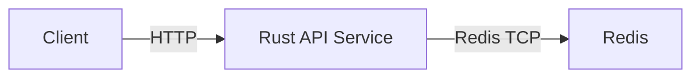

# CSC 581 Course Project – Service Status Counter

This project will implement a simple cloud-style service composed of two containerized components: a
Rust-based REST API and a Redis datastore. The API will expose endpoints to increment and retrieve a
counter value, while Redis is used to persist state across requests.

## Vision

The system consists of a backend API service that communicates with a Redis datastore over a Docker
bridge network. Clients interact only with the API via HTTP, while Redis remains internal to the
deployment.

### Architecture Diagram

## Proposal

The project will use the following base images:

- **Rust API Service**
  The API will be built using the official Rust Docker image (`rust`).

- **Redis Datastore**
  The Redis service will use the official Redis image (`redis`).
