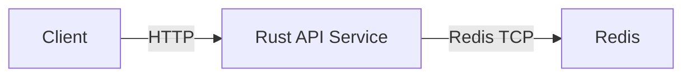

# CSC 581 Course Project – Service Status Counter

This project will implement a simple cloud-style service composed of two containerized components: a
Rust-based REST API and a Redis datastore. The API will expose endpoints to increment and retrieve a
counter value, while Redis is used to persist state across requests.

## Vision

The system consists of a backend API service that communicates with a Redis datastore over a Docker
bridge network. Clients interact only with the API via HTTP, while Redis remains internal to the
deployment.

### Architecture Diagram


```mermaid
flowchart LR
    Client -->|HTTP| API[Rust API Service]
    API -->|Redis TCP| Redis[Redis]
```

## Proposal

The project will use the following base images:

- **Rust API Service**
  The API will be built using the official Rust Docker image (`rust`).

- **Redis Datastore**
  The Redis service will use the official Redis image (`redis`).

## Build Process

- `FROM nixos/nix:2.29.0 AS builder`: Uses Nix as the build environment so Rust toolchain and build inputs come from the project flake, which makes builds reproducible.
- `WORKDIR /workspace`: Sets a consistent working directory for subsequent build steps.
- `COPY flake.nix rust-toolchain.toml ./`: Copies Nix/Rust toolchain definitions first so dependency/toolchain layers can be cached separately from source changes.
- `COPY api ./api`: Copies the API source tree into the image.
- `RUN nix --extra-experimental-features 'nix-command flakes' develop --accept-flake-config --command cargo build --release --manifest-path api/Cargo.toml`: Enters the flake dev environment and builds a release binary using the pinned toolchain.
- `FROM debian:bookworm-slim AS runtime`: Switches to a lightweight runtime base image to keep the final image smaller than a full Nix image.
- `RUN apt-get update && apt-get install -y --no-install-recommends ca-certificates && rm -rf /var/lib/apt/lists/*`: Installs CA certificates for outbound TLS connections and removes apt cache to reduce image size.
- `WORKDIR /app`: Sets runtime working directory.
- `COPY --from=builder /workspace/api/target/release/service-status-api /usr/local/bin/service-status-api`: Copies only the compiled application from the builder stage into the runtime stage.
- `EXPOSE 3000`: Documents the API listening port.
- `ENV BIND_ADDR=0.0.0.0:3000`: Sets the default bind address for the server process.
- `ENV RUST_LOG=info`: Sets a default log level.
- `CMD ["/usr/local/bin/service-status-api"]`: Starts the API binary when the container launches.

Base image choice rationale:

- Builder image `nixos/nix` was chosen for reproducibility and consistency with the root flake-based development workflow.
- Runtime image `debian:bookworm-slim` was chosen to minimize final image size while keeping a standard, stable Linux userland.

## Development Setup

This repository uses a root-level Nix flake for a reproducible Rust development shell.

```bash
nix develop
```

## API Service (Axum)

The API lives in `api/` and exposes three endpoints:

- `GET /health` returns service health.
- `GET /counter` returns the current counter value.
- `POST /counter/increment` increments the counter and returns the new value.

